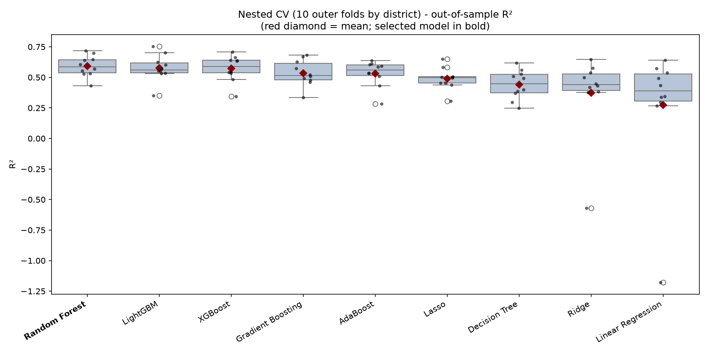
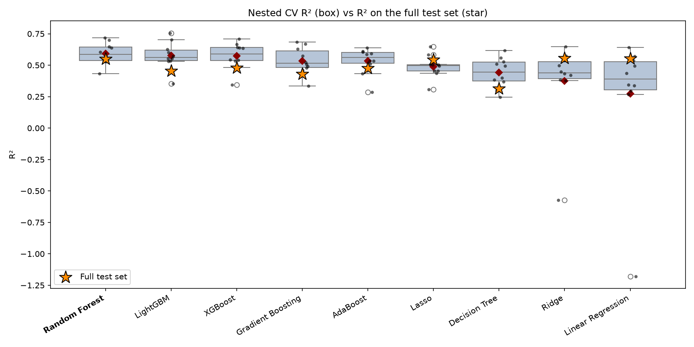
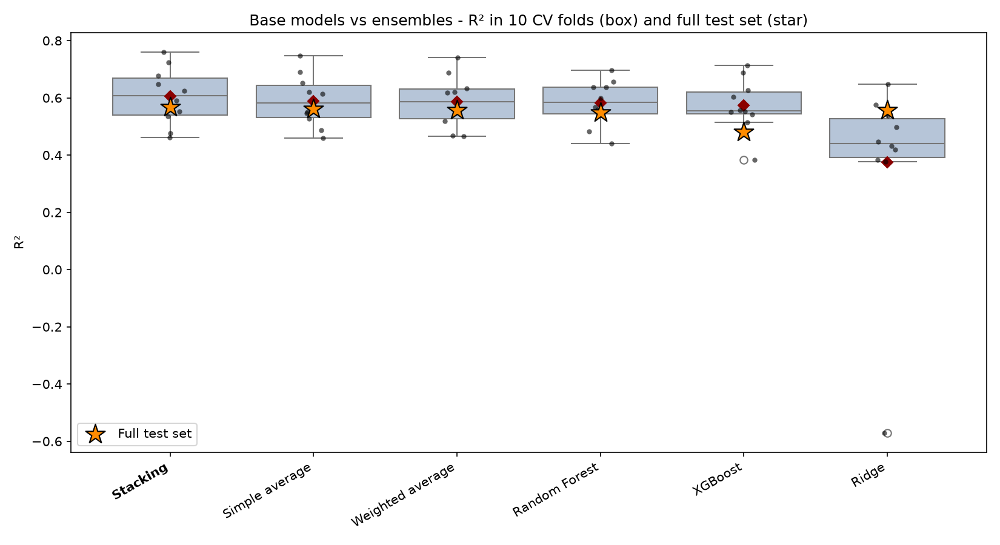

# Poverty Prediction in Peru: Block-Level Urban Poverty with Machine Learning

This project predicts the **poverty rate (%) of urban city blocks (*manzanas*) in Peru** with machine learning.
It combines 2017 census data, satellite (remote sensing) data and district-level administrative data.

## Motivation

Peru's national statistics institute (INEI) published the 2018 poverty map disaggregated to the
**block level only for some large urban cities**. Most urban areas of the country have no block-level
poverty estimate at all. Only 73 of the 1,104 districts with urban blocks have it.

This project trains machine learning models on the blocks that do have a poverty rate. It then uses
the best model to **predict the poverty rate of the urban blocks that don't**.

| | Blocks | Districts |
|---|---:|---:|
| Urban blocks with 2018 poverty rate (training + test) | 115,948 | 73 |
| Urban blocks without poverty rate (prediction) | 83,967 | 1,032 |

## Predictors

| Group | Level | Variables | Source |
|---|---|---|---|
| **Census 2017** | Block | Population share by age group (15-29, 30-44, 45-64); share with higher education; share without health insurance; share whose native language is not Spanish; employment rate; share of white-collar workers; share of workers by economic sector (extractive, manufacturing & construction, services) | INEI, *Censo de Población y Vivienda 2017* |
| **Remote sensing** | Block | Night-light density (VIIRS DNB monthly, 2017 average); elevation (SRTM 90 m); annual mean temperature (WorldClim bio01) | Google Earth Engine |
| **Location** | Block | Latitude and longitude of the block centroid | Block shapefile 2017 |
| **District poverty** | District | Poverty rate 2013 | INEI |
| **Social program** | District | Dummy = 1 if the district received the *Juntos* conditional cash transfer program | MINEDU school census |
| **Municipal finances** | District | Municipal revenue and spending (infrastructure, health, education, etc.) in millions of soles per 1,000 inhabitants | INEI, RENAMU 2016 |

**Target:** `Pobreza2018`, the poverty rate (%) of the block, from INEI's *Mapa de Pobreza 2018*
(urban disaggregation).

## Pipeline

```
Procesing_data_GoogleEarth.ipynb   ->  night lights, elevation and temperature per block (Google Earth Engine)
Feature_Engineering.ipynb          ->  census shares, merges, outlier detection and imputation -> DataForML.dta
TrainingModel.ipynb                ->  nested CV, model selection, ensembles, test evaluation, predictions
```

### 1. Feature engineering, outlier detection and imputation

For each block-level variable (census shares and night lights), the notebook tries several
**outlier-detection** methods. It sets the detected outliers to missing:

- **Interquartile range (IQR)**: values outside `[Q1 - 1.5·IQR, Q3 + 1.5·IQR]`.
- **DBSCAN**: density-based clustering; points outside any cluster are outliers.
- **Local Outlier Factor (LOF)**: points with much lower local density than their neighbors.
- **Isolation Forest**: points that are isolated with few random splits.

It fills the resulting missing values with three **imputation** methods:

- **Mean** imputation.
- **KNN imputer** (10 neighbors, on min-max scaled data).
- **MissForest** (iterative imputation with random forests).

This gives 4 × 3 = 12 candidate versions of each variable. The notebook keeps the version whose distribution
is **closest to the original**. It first prefers versions where the Kolmogorov-Smirnov test does not reject
equal distributions, then the smallest change in skewness, then the smallest change in kurtosis.
DBSCAN and LOF run on 10 random blocks of the data in parallel to handle the roughly 200,000 blocks.

### 2. Train-test split by district

The data is split **80% train / 20% test by district (UBIGEO)**, not by block. All blocks of a district
fall in the same set. This reduces the spatial correlation between the two sets, so the test measures how
well the model predicts **new districts**, which is the real use case.

- Train: 92,387 blocks in 58 districts.
- Test: 23,561 blocks in 15 districts. They are never used for training or hyperparameter tuning.

### 3. Model comparison with nested cross-validation

Nine models are compared, each inside a pipeline with median imputation. Linear models also get
standardization.

- **Linear:** Linear Regression, Lasso, Ridge.
- **Tree-based:** Decision Tree, Random Forest, Gradient Boosting (histogram-based), XGBoost, LightGBM, AdaBoost.

**Nested cross-validation** runs on the training set, with folds also built by district:

- **Outer loop (10 folds):** gives 10 out-of-sample R² values per model.
- **Inner loop (3 folds):** `RandomizedSearchCV` (20 combinations) tunes the hyperparameters inside each outer training fold.

The selected base model follows the **one-standard-error rule**. Among the models whose mean R² is within
one standard error of the best model, the one with the lowest R² standard deviation is chosen.

### 4. Ensembles

The best models with different learning biases (Random Forest, XGBoost and Ridge) are combined in three ways:

- **Simple average** of the three predictions.
- **Weighted average**: non-negative weights that sum to 1 and minimize the MSE of the out-of-fold predictions.
- **Stacking**: a linear meta-model with non-negative coefficients, fitted on out-of-fold predictions
  (5 folds by district).

The final model is the one with the highest mean R² in cross-validation on the training set. It is chosen
**without looking at the test set**, and then evaluated on the **full test set**.

## Results

### Nested cross-validation: all models (10 outer folds, out-of-sample)

| Model | R² mean | R² std | R² min | R² max | RMSE mean | Within 1-SE of best |
|---|---:|---:|---:|---:|---:|:---:|
| **Random Forest** | **0.592** | 0.087 | 0.433 | 0.717 | 5.62 | ✔ |
| LightGBM | 0.578 | 0.109 | 0.352 | 0.755 | 5.71 | ✔ |
| XGBoost | 0.573 | 0.107 | 0.345 | 0.707 | 5.73 | ✔ |
| Gradient Boosting | 0.535 | 0.106 | 0.336 | 0.683 | 5.99 | |
| AdaBoost | 0.533 | 0.106 | 0.285 | 0.638 | 6.00 | |
| Lasso | 0.489 | 0.090 | 0.307 | 0.649 | 6.27 | |
| Decision Tree | 0.441 | 0.120 | 0.247 | 0.618 | 6.55 | |
| Ridge | 0.375 | 0.344 | −0.571 | 0.648 | 6.70 | |
| Linear Regression | 0.274 | 0.526 | −1.179 | 0.640 | 7.08 | |

**Random Forest** has the highest mean R² and is also the most stable of the three candidates, so it is the
selected base model. Tree-based ensembles clearly beat the linear models. The linear models also have a very
unstable R² across districts.



*Each point is one outer fold (a set of held-out districts). Red diamond = mean.*

The test-set performance of each base model is shown below. Each model uses its final hyperparameters,
tuned on the full training set.

| Model | CV R² mean | Test R² | Test RMSE | Test MAE |
|---|---:|---:|---:|---:|
| **Random Forest** | 0.592 | **0.549** | 6.09 | 4.68 |
| LightGBM | 0.578 | 0.456 | 6.69 | 5.00 |
| XGBoost | 0.573 | 0.480 | 6.54 | 4.95 |
| Gradient Boosting | 0.535 | 0.430 | 6.84 | 5.09 |
| AdaBoost | 0.533 | 0.477 | 6.56 | 4.98 |
| Lasso | 0.489 | 0.545 | 6.12 | 4.84 |
| Decision Tree | 0.441 | 0.312 | 7.52 | 5.63 |
| Ridge | 0.375 | 0.556 | 6.04 | 4.79 |
| Linear Regression | 0.274 | 0.552 | 6.07 | 4.82 |



The linear models score well on this particular test set, but the nested CV shows they are unreliable across
districts. In some folds their R² is strongly negative. The test set has only 15 districts, so a single
test-set number is a noisier guide than the 10 outer folds.

### Ensembles

The table shows 10-fold CV on train (same folds as the nested CV) and the full test set. Rows are sorted by
CV R², with the best model first.

| Model | Type | CV R² mean | CV R² std | CV RMSE | Test R² | Test RMSE | Test MAE |
|---|---|---:|---:|---:|---:|---:|---:|
| **Stacking** | Ensemble | **0.605** | 0.100 | 5.50 | **0.567** | **5.96** | **4.50** |
| Simple average | Ensemble | 0.590 | 0.091 | 5.61 | 0.562 | 6.00 | 4.56 |
| Weighted average | Ensemble | 0.586 | 0.090 | 5.65 | 0.556 | 6.04 | 4.60 |
| Random Forest | Base | 0.582 | 0.080 | 5.70 | 0.549 | 6.09 | 4.68 |
| XGBoost | Base | 0.573 | 0.094 | 5.76 | 0.480 | 6.54 | 4.95 |
| Ridge | Base | 0.375 | 0.344 | 6.70 | 0.556 | 6.04 | 4.79 |



*Box = 10 CV folds on train; orange star = R² on the full test set.*

### Final model: Stacking

**Stacking** is the best model both in cross-validation and on the unseen test set:

| Metric (full test set, 15 unseen districts) | Value |
|---|---:|
| R² | **0.567** |
| RMSE (percentage points) | 5.96 |
| MAE (percentage points) | 4.50 |

The meta-model fitted on the full training set is:

```
Poverty = −3.14 + 1.038 · RandomForest + 0.124 · Ridge + 0.049 · XGBoost
```

Random Forest dominates. Ridge and XGBoost add small corrections.

## Predictions for blocks without data

Stacking is refitted on all 115,948 labeled blocks with fixed hyperparameters. It then predicts the poverty
rate of the 83,967 urban blocks without data. The output is
`output/ModelNestedCV/Ensembles/predictions_Stacking.csv` with these columns:

| Column | Description |
|---|---|
| `IDMANZANA` | Block identifier |
| `UBIGEO` | District code |
| `Pobreza2018_pred` | Predicted poverty rate (%) |
| `dpredict` | Always 1: the value is a model prediction |

The poverty rate is a percentage, so **predictions below 0 or above 100 are set to missing**.
This affects 15,021 blocks (17.9%). Most of them come from the Ridge component, which extrapolates badly for
blocks whose features fall far outside the training range.

## Repository structure

```
├── notebook/
│   ├── Procesing_data_GoogleEarth.ipynb   # Night lights, elevation, temperature per block (GEE)
│   ├── Night_light_quarters_VIRRS.ipynb   # Earlier night-light extraction (grids / districts)
│   ├── Feature_Engineering.ipynb          # Census features, merges, outliers, imputation
│   └── TrainingModel.ipynb                # Nested CV, ensembles, evaluation, predictions
├── scr/
│   └── utils.py                           # Helper functions (GEE, outliers, imputation, training, ensembles, plots)
├── output/ModelNestedCV/                  # Results: tables, figures, Excel report
├── requirements.txt
└── LICENSE
```

## How to reproduce

```bash
python -m venv .venv
.venv\Scripts\activate          # Windows  (Linux/macOS: source .venv/bin/activate)
pip install -r requirements.txt
```

Then run the notebooks in the order of the pipeline above. The data files are **not included** in the
repository because of their size. The raw data comes from INEI (Census 2017, *Mapa de Pobreza 2018*,
poverty 2013, RENAMU 2016), MINEDU and Google Earth Engine, and is expected under `data/raw_data/`.

The remote-sensing notebooks need a Google Earth Engine account. Install the package with
`pip install earthengine-api`. Do **not** install the unrelated PyPI package called `ee`: it fails on Windows
with `No module named '_curses'`.

`TrainingModel.ipynb` saves checkpoints (`.joblib` / `.csv`) after each model and each fold. If a run is
interrupted, running the notebook again skips the finished steps.

## License

Apache License 2.0. See [LICENSE](LICENSE).
